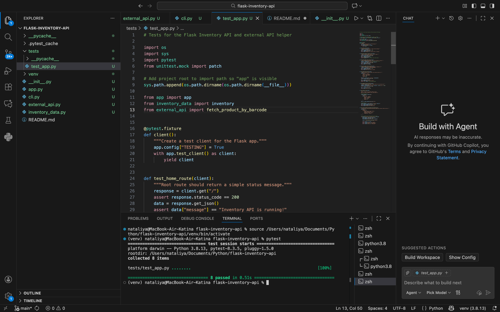

# Flask-inventory-api
A Flask-based Inventory Management API with CRUD operations and external barcode lookup using OpenFoodFacts.

Features
	•	GET /inventory – returns all items
	•	GET /inventory/ – returns a single item by ID
	•	POST /inventory – adds a new item
	•	PATCH /inventory/ – updates an existing item
	•	DELETE /inventory/ – removes an item
	•	GET /external/ – retrieves product information from OpenFoodFacts

Project Structure
flask-inventory-api/
│
├── app.py                # Main Flask application (CRUD routes)
├── inventory_data.py     # In-memory "database"
├── external_api.py       # Barcode lookup helper
├── cli.py                # Command-line interface for interacting with the API
│
├── tests/
│   └── test_app.py       # Full test suite (8 passing tests)
│
└── README.md

## Installation
```bash
git clone <https://github.com/N252614/flask-inventory-api.git>
cd flask-inventory-api
python3 -m venv venv
source venv/bin/activate
pip install flask requests pytest
```

## Running the Server
``` bash
python app.py
```
The API runs at:
http://127.0.0.1:5001

## Example Requests
Add a new item (POST)
``` bash
curl -X POST http://127.0.0.1:5001/inventory \
  -H "Content-Type: application/json" \
  -d '{"barcode":"111111","name":"New Product","brand":"TestBrand","price":5.99,"stock":10}'
  ```
  Update an item (PATCH)
``` bash
curl -X PATCH http://127.0.0.1:5001/inventory/1 \
  -H "Content-Type: application/json" \
  -d '{"price": 6.49}'
  ```
  Delete an item
  ``` bash
  curl -X DELETE http://127.0.0.1:5001/inventory/1
  ```
  Lookup external product by barcode
  ``` bash
  http://127.0.0.1:5001/external/<barcode>
  ```

  ### Screenshot
  Below is an example of the API running in the browser:



  ## Running Tests
  ``` bash
  pytest
  ```
  All 8 tests should pass successfully.

